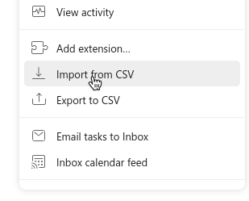
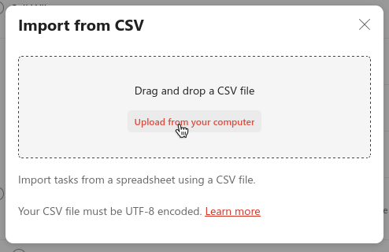
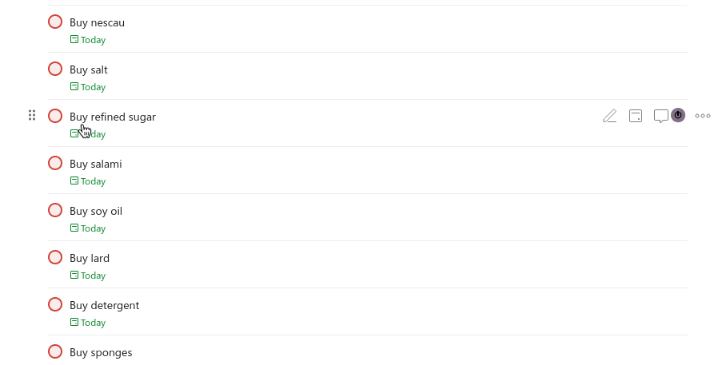

Once a month, I have to go to the supermarket so I can get groceries and other things.
Usually I check the pantry and the bathroom while holding my phone,
and when I need to buy something I write it down in a markdown file like this:

```md
# My shopping list

## P1

- Milk
- Coffee (Dark Roast)
[ ... more items ... ]
- Toothpaste
- Toilet paper
- Paper towels
- Hair gel

## P2

- Ketchup
- Mustard
- Requeijão
- Cacau powder

## P3

- Toast
- Biological yeast
```

As you see I have multiple headings correlating to the priority level. I used to
type it into Obsidian, then go to my computer and copy it into Todoist manually.

However, I have now created a simple (badly made) python script that converts
the markdown files I write into a .CSV file, which can then be imported into Todoist.

```sh
$ python md2task.py 'Shopping List.md'
$ la
.rw-r--r-- 1.7k lost 30 May 21:32 📄️ md2task.py
.rw-r--r--  321 lost 30 May 21:32 📄️ 'My shopping list.md'
.rw-r--r-- 1.5k lost 30 May 21:44 📄️ output.csv
```

Then...



And then...



A bunch of tasks show up on my Todoist:



Here is my badly made script:

```py
from argparse import ArgumentParser

parser = ArgumentParser()
parser.add_argument('file')
parser.add_argument('-o', '--output', type=str, default="output.csv")

args = parser.parse_args()
file = args.file
output = args.output

p1 = []
p2 = []
p3 = []
p4 = []

with open(file) as f:
    data = f.readlines()

current_header = 1
lower_first = lambda s: s[:1].lower() + s[1:] if s else ''

for line in data:
    if line.strip() == "": continue
    if line.startswith("#"):
        if "1" in line:
            current_header = 1
        if "2" in line:
            current_header = 2
        if "3" in line:
            current_header = 3
        if "4" in line:
            current_header = 4
        continue
    item = "Buy " + lower_first(line.removeprefix("- ").removeprefix("* ").removeprefix("+ ").strip())
    if current_header == 1:
        p1 += [item]
    elif current_header == 2:
        p2 += [item]
    elif current_header == 3:
        p3 += [item]
    elif current_header == 4:
        p4 += [item]

print(p1, p2, p3, p4)

def generate_task(string, priority):
    k = f"task,{string},,{str(priority)},1,,,today,en,America/Sao_Paulo,,,,"
    return k

with open(output, 'w') as f:
    f.write('TYPE,CONTENT,DESCRIPTION,PRIORITY,INDENT,AUTHOR,RESPONSIBLE,DATE,DATE_LANG,TIMEZONE,DURATION,DURATION_UNIT,DEADLINE,DEADLINE_LANG\n')
    f.write('meta,view_style=list,,,,,,,,,,,,\n')
    f.write(',,,,,,,,,,,,,\n')
    for task in p1:
        f.write(generate_task(task, 1) + "\n")
    for task in p2:
        f.write(generate_task(task, 2) + "\n")
    for task in p3:
        f.write(generate_task(task, 3) + "\n")
    for task in p4:
        f.write(generate_task(task, 4) + "\n")

print("Done")
```

Enjoy!
